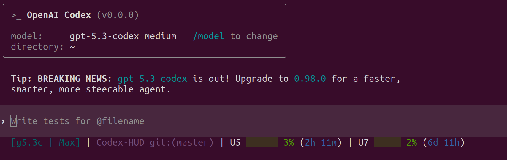

# Codex HUD

Codex HUD adds a minimal single-line usage HUD to Codex CLI and ships a release-friendly install path for `macOS arm64`.

It renders:

```text
[g5.3c] | project git:(main) | 5h ██░░ 25% | 7d ███░ 80%
```

The HUD reads Codex rollout logs and injects a compact status line through a small patch to the Codex TUI.



## Why This Exists

Codex already has a TUI status line, but it does not expose an external status-line command hook by default. This project adds that hook through a small patch, then uses rollout logs to render a compact HUD with only the information you usually need while working:

- model
- project
- Git branch
- 5-hour usage
- 7-day usage

## Features

- Minimal default status line with no extra panels in `--status-line` mode
- Release-first installer for `macOS arm64`
- Bundled patched `codex` release asset for the primary supported platform
- Source-build fallback when a release asset is unavailable
- Isolated upstream Codex checkout under `~/.codex-hud/vendor/openai-codex`
- Automatic `~/.codex/config.toml` wiring through `status_line_command`

## Current Support

- macOS arm64
- zsh / bash
- Node.js 18+
- Rust toolchain (`cargo`)

`macOS arm64` is the primary tested release target. The repository still keeps a source-build path for other environments, but the prebuilt release flow is currently focused on Apple Silicon Macs.

## Install

```bash
git clone https://github.com/sakuraay/codex-hud.git
cd codex-hud
./install.sh
```

By default on `macOS arm64`, `install.sh` will try to download the latest release asset first. If that is unavailable, it falls back to the source-build path.

### Install A Specific Version

```bash
./install.sh --version v0.1.0
```

### Force A Source Build

```bash
./install.sh --prefer-source
```

## How It Works

Release install path:

1. Downloads `codex-hud-macos-arm64-release.tar.gz` from GitHub Releases
2. Installs the bundled patched `codex` binary to `~/.local/bin/codex`
3. Stores HUD runtime files under `~/.codex-hud/releases/<version>/`
4. Writes `[tui].status_line_command` to `~/.codex/config.toml`

Source-build fallback path:

1. Builds this HUD with `npm ci` and `npm run build`
2. Clones `openai/codex` into `~/.codex-hud/vendor/openai-codex`
3. Checks out the pinned upstream commit `1dc3535e17666884800ada37d7eb94cf974d38fe`
4. Applies `patches/codex-statusline-command.patch`
5. Builds patched `codex`
6. Installs the binary to `~/.local/bin/codex`
7. Writes `[tui].status_line_command` into `~/.codex/config.toml`

After install, restart Codex so the new status line is loaded.

## Release Assets

Current release automation publishes:

- `codex-hud-dist.tar.gz`
- `codex-hud-macos-arm64-release.tar.gz`

The macOS release asset contains:

- the patched `codex` binary
- HUD `dist/`
- the config helper script
- a `VERSION` file for install-time placement under `~/.codex-hud/releases/`

## Verify

```bash
codex --version
grep -n "status_line_command" ~/.codex/config.toml
node dist/index.js --status-line --once --no-clear
```

Expected HUD output looks like:

```text
[g5.4] | levi | 5h ██░░ 58% | 7d █░░░ 19%
```

## Scope

This repo only writes to:

- `~/.local/bin/codex`
- `~/.codex/config.toml`
- `~/.codex-hud/`
- your shell rc files for `PATH` precedence (`~/.zshrc`, `~/.bashrc`)

It does not patch or overwrite arbitrary `openai/codex` clones elsewhere on your machine.

## CI And Releases

- `CI` runs on pushes to `main` and pull requests
- `Release` runs on tags like `v0.1.0`
- Release assets are built on `macos-15` arm64 runners

## Development

```bash
npm run build
npm run dev
npm test
```

## Repository Layout

- `src/`: HUD parser and renderer
- `tests/`: test cases
- `scripts/`: install/config helpers
- `patches/`: Codex patch
- `docs/`: notes, analysis, and specs

## Troubleshooting

- HUD not visible: exit Codex completely and start a fresh session
- `codex` still resolves to another binary: open a new shell, or run `export PATH="$HOME/.local/bin:$PATH" && hash -r`
- Release install failed on macOS: rerun with `./install.sh --prefer-source`
- Patch no longer applies: upstream Codex changed, so regenerate `patches/codex-statusline-command.patch` against a fresh vendor checkout

## Support

- Issues: `https://github.com/sakuraay/codex-hud/issues`
